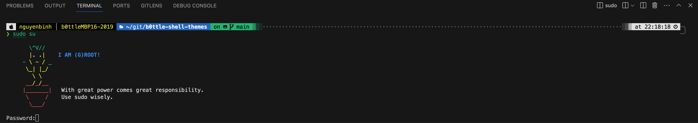

# Suoder spice when entering to the sudo session

# References: 
I refer this https://www.cyberciti.biz/open-source/command-line-hacks/adding-spice-to-your-sudo-session-with-a-lecture-file-on-linux-or-unix/

## For Linux

## For MacOS
- do like above refer link