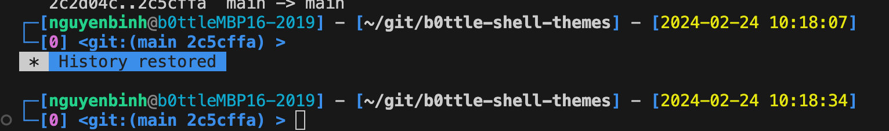

# my macOS-zsh shell

## tutorial 

- Install oh-my-zsh firsly
```
sh -c "$(curl -fsSL https://raw.githubusercontent.com/ohmyzsh/ohmyzsh/master/tools/install.sh)"
```
**If it installs for `root`. Execute `sudo su` firstly, then execute the above command**
- theme of zsh: edit file `~/.zshrc`
```
ZSH_THEME="rkj-repos"
```

The terminal at this moment wil be like this :D


- install for **`all users`**
```
it will be updated soon.
```
---
### Install theme powershell-10k
---

- install VIM
```
brew install vim
```
Refer : https://vi.stackexchange.com/questions/13099/not-able-to-copy-from-terminal-when-using-vim-from-homebrew-on-macos

>There are few thing you can do to solve this. Homebrew compiled Huge version, while default Vim is in Normal version. Huge adds for example clipboard and more mouse/terminal support. This makes selecting with mouse actually select in Vim (so changes to Visual mode) instead of doing selection on terminal layer. Having that said, you can:
>
>press "+y or "*y in Homebrew version after doing the selection,
ask Homebrew to compile Normal version or without mouse_* features (but I don't know the details of how to do that),
select holding Shift and then do the copy stuff as usual (holding Shift should make terminal selection and not passing this to the app running in that terminal)
`set mouse=` in your `.vimrc` to disable interaction with a mouse, but this will disable mouse support for good, so no more selecting focused window, resizing windows, etc.

- color of text while

I refered this : https://stackoverflow.com/questions/46350636/how-do-i-edit-vims-color-scheme-for-better-syntax-highlighting-in-mac-os-x-sier
>Here's how to install syntax coloring in vim for Mac OS X Sierra/High Sierra:
>
>1. Download a vim color scheme:
>
>You can download one here: https://github.com/flazz/vim-colorschemes
>
>2. Move color scheme into the colors directory inside your local .vim directory. (Create one if one does not exist.)(Assuming scheme is in local Downloads folder) mv ~/Downloads/molokai.vim ~/.vim/colors/
>Create the colors and ~/.vim directories if they do not exist: mkdir -p ~/.vim/colors/
>
>3. Set syntax coloring in Mac OS X Sierra/High Sierra: Run the following command in Terminal: set term=builtin_ansi
>
>4. Update/Create local .vimrc file:
>
>>```
>>vim ~/.vimrc
>
>Your .vimrc file should look similar to the following:
>
>> syntax on
>
>> colo molokai
>5. Restart terminal
